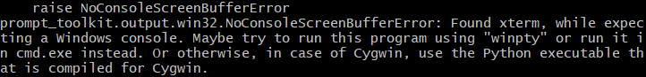
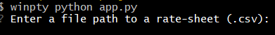
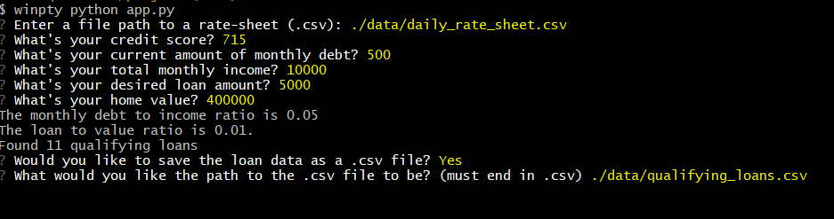
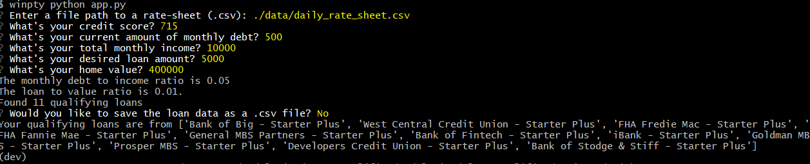

# A Modularized Implementation For A Loan Qualifier Application

In today's age of automated finance it is important for lenders to make split second decisions to determine an applicants credit qualifications to find and secure loans that they may be qualified for. This application uses a stream-lined algorithm to determine a selection of loans that an applicant is qualified for based on their pertinent financial information and the qualifications provided by various lenders. 

Given an applicants credit score, income, home value, debt, and the loan amount that they are requesting, our application is able to sort through an array of possible lenders to find the loans that the candidate qualifies for.

This application is designed to analyze one applicant and their credit-worthiness through an easy to follow user interface which requests the data via prompts on the application terminal. Any financial advisor can use this application with minimal coding experience by referring to the following documentation.

This application could be scaled to account for a much wider selection of lenders and could be augmented to iterate through a list of candidate information with some minor changes to the user interface. 

---

## Technologies

___

* This program is written in Python using version 3.7

* Further versions of Python may be considered with reference to and reconciliation of all dependencies

* In order to ensure the proper version is used for this application the user is encouraged to use an anaconda development environment. Refer to the *Environment Setup* guide in the *Installation Guide* section of this documentation.

* This application can be run in a Windows, MacOS, or Linux Operating system in addition to a Git Bash Application for Windows (refer to the *Git Bash* guide of the *Windows* section of the documentation).

---

## Installation Guide

___

## *Environment Setup*
* For best usage create an anaconda development environment using python version 3.7
* Refer to [Anaconda's Website](https://www.anaconda.com/) to download the most recent version of conda
* In the terminal run the following command to set up a conda environment 
```terminal
$ conda create dev python=3.7
```
* To initialize the environment, first navigate to your working directory, then in the terminal:
```terminal
$ conda activate dev
```

## *Dependencies Installation*
* This application requires the importation of two external libraries **Fire** and **Questionary**. To download these libraries visit the [Fire](https://pypi.org/project/fire/) and [Questionary](https://pypi.org/project/questionary/) webpages and refer to their documentation.

* This application also requires the **csv**, **pathlib**, and **sys** libraries which come pre-installed in python but must be imported into the application using the following code in the app.py file.

``` python
from pathlib import Path
import sys
import csv
```
* The *fileio.py* file requires the import of **csv**, **questionary**, and **pathlib**. 
```python
import csv
import questionary
from pathlib import Path
```


---

## Usage
___

## *File Structure*

* The modularized_loan_qualifier root folder contains the project folder for the application.

* The project folder contains the *data* folder, which houses the .csv file for the available lender, the *qualifier* folder which houses the utility functions to determine a valid credit score, debt to income ratio, loan to value ratio, and a maximum loan size and the *app.py* file which runs the main application.

* The  *app.py* file is the main application and imports the helper functions throughout the other modules of the project directory.

* The *fileio.py* application contains the following modules: load_csv, save_csv. These utility functions are imported into the *app.py* file to prompt the user to load and save the data for the application. 

* The *calculators.py* application contains the following modules: calculate_monthly_debt_ratio, calculate_loan_to_value_ratio. These utility functions are imported into the *app.py* file to serve the find_qualifying_loans function. 

## *Git Bash*
* The following is a common error when using the **Questionary** library in a Git Bash application. Git Bash in this instance does not have a native program to render the UI for questionary prompts. 

* The application must be run using the **winpty** package to address UI issues in the Git Bash terminal.
* Run the following command in the terminal at application deployment.
``` terminal
$ winpty python app.py
```
## *Running Main Program*
* The main program is run from the *project* directory, so a user must navigate to it first and then run the python command on the file:
```terminal
$ python app.py
```
* Following the command to run the main program, a prompt will appear to the user for their first response which is the relative file path to the .csv file for the *daily_rate_sheet*:
* The user should refer to the path that houses the lenders data that they will be using. This prompt emerges from the load_bank_data function in the main application and is used as a parameter to find the qualifying loans.


* The user will then be confronted with a string of prompts in order to attain their (or their client's) personal financial information, which will be referenced with the lender data to find the loans that they qualify for. 


* Finally the user must decide whether to output the qualifying loans to a new .csv file. They are confronted with another prompt asking "Yes" or "No".


* If the user answers "Yes" they are directed to specify the path that they would like the file to be saved as. The file path must be valid and must end in .csv. 

* If the user answers "No" the terminal returns a list of qualifying loans and the program is terminated. 

---

## Contributors

___
* UC-Berkeley Extension Fintech Administrators and Instructors
* Kevin Lee
* Benjamin Gunnels

## *Contact*

* Contact me: bengunnels8@gmail.com
* LinkedIn: https://www.linkedin.com/in/ben-gunnels-61a00b242/
* Github: https://github.com/miltiades-the-general


---

## License

___

MIT License

Copyright (c) 2022 Benjamin J. Gunnels

Permission is hereby granted, free of charge, to any person obtaining a copy
of this software and associated documentation files (the "Software"), to deal
in the Software without restriction, including without limitation the rights
to use, copy, modify, merge, publish, distribute, sublicense, and/or sell
copies of the Software, and to permit persons to whom the Software is
furnished to do so, subject to the following conditions:

The above copyright notice and this permission notice shall be included in all
copies or substantial portions of the Software.

THE SOFTWARE IS PROVIDED "AS IS", WITHOUT WARRANTY OF ANY KIND, EXPRESS OR
IMPLIED, INCLUDING BUT NOT LIMITED TO THE WARRANTIES OF MERCHANTABILITY,
FITNESS FOR A PARTICULAR PURPOSE AND NONINFRINGEMENT. IN NO EVENT SHALL THE
AUTHORS OR COPYRIGHT HOLDERS BE LIABLE FOR ANY CLAIM, DAMAGES OR OTHER
LIABILITY, WHETHER IN AN ACTION OF CONTRACT, TORT OR OTHERWISE, ARISING FROM,
OUT OF OR IN CONNECTION WITH THE SOFTWARE OR THE USE OR OTHER DEALINGS IN THE
SOFTWARE.
